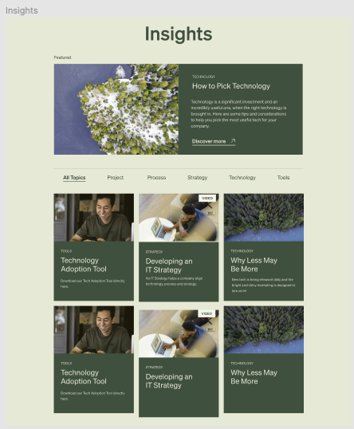
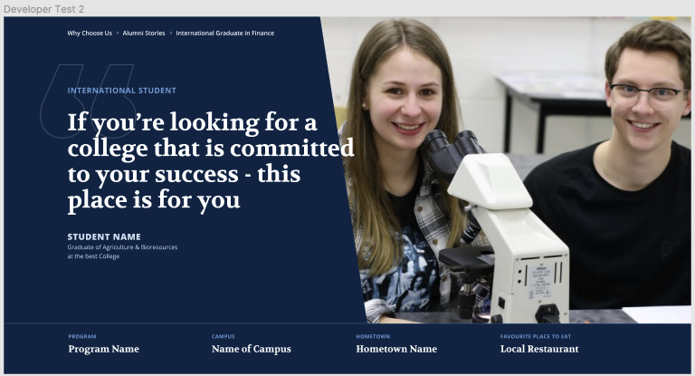

# GOAT DEV SCREENING 

Github repo to assess technical ability using HTML, CSS and JS. Assessment has been split into three sections, each having their own directory in the repository. 

# Section 1 - Recreate a simple component
### Directory name: dev_test_1 

For this section, I had to build the following component.

For styling, I used Bootstrap 5 to design the rows and columns, and to ensure they are mobile responsive. 

The colors were taken from the provided Figma file.

The font on the Figma file was 'Sohne', however, I did not have acces to Sohne, so used a the Google Font 'Opens Sans' as an alternative. 

The images were taken from the Figma file, and resized as necessary to fit. 

The insights cards were created using Bootstrap Cards, and then styled using the font, color and content from the Figma file.

To make page mobile responsive I have used media queries within the CSS file. 
When viewing a mobile phone sized screen the featured row is split into two with the image first. 
The categories menu stays on one line with smaller margins and font sizes. 
The insight cards stack on top of each other and becomes 1 per row. 

The second media query used was for an iPad and iPad Pro, the display is the same as larger screens, but the font sizes and widths had to be slightly decreased to ensure it fit on the row. 

# Section 2 - Recreate a complex component
### Directory name: dev_test_2

For this section, I had to build the following component.

The fonts used for this section are the same as the Figma fonts and are from Google Fonts:
* Opens Sans
* Volkhov 

Bootstrap 5 was used to style the breadcrumbs at the top left of the page and the 4 frames at the bottom of the page to create a row with four mobile responsive columns. 

The colors and images were provided from the Figma file. 

To style this component, position:absolute was used to help with the overlay of the image and the text. 

To make page mobile responsive I have used media queries within the CSS file. 
When viewing a mobile phone sized screen the image of the two student is set to display:none. The breadcrumbs and quote stay the same but is decreased in size so that they fit the screensize.
The four frames at the bottom turn into four rows. 

The second media query used was for an iPad and iPad Pro, the display is the same as larger screens, but the font sizes and widths had to be slightly decreased to ensure it fit on the row. 